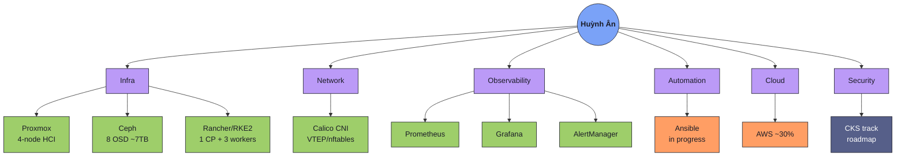

<h1 align="center">Hi 👋, I'm Huỳnh Ân</h1>

  

<table width="100%">
  <tr>
    <td width="60%" valign="top">
      
2nd-year CS student @ UIT, Vietnam — interning and building production-grade infrastructure on real hardware, not just tutorial labs. I break things, write down why, and fix them properly.

      

        
        
      

      

        <!-- Replace with your real links when ready -->
        
        
      

      

         
         
        
      

    </td>
    <td width="40%" valign="top" align="center">
      <!-- Replace REPLACE_ME with your Spotify user ID from Share > Copy link to profile -->
      
    </td>
  </tr>
</table>

---

### 🗺️ Where I stand — a map, not a list

---

### 📌 Featured project

---

### 📊 GitHub Stats

<table width="100%">
  <tr>
    <td width="50%"></td>
    <td width="50%"></td>
  </tr>
</table>
