<h1 align="center">Hi 👋, I'm Huỳnh Ân</h1>

  

<table width="100%">
  <tr>
    <td width="60%" valign="top">
      
2nd-year CS student @ UIT, Vietnam — interning and building production-grade infrastructure on real hardware, not just tutorial labs. I break things, write down why, and fix them properly.

      

        
        
      

      

        <!-- Replace with your real links -->
        
        
        
        
      

    </td>
    <td width="40%" valign="top" align="center">
      <!--
        TODO: this widget needs YOUR OAuth authorization, a public profile link isn't enough.
        1. Go to https://spotify-recently-played.jeffreyca.workers.dev
        2. Click "Connect with Spotify" and log in with your own account
        3. Pick theme "Tokyo Night", Tracks = 5
        4. Click "Copy snippet" and paste it here, replacing this whole <td>...</td> block
      -->
      
    </td>
  </tr>
</table>

---

<table width="100%">
  <thead>
    <tr><th align="left">My Journey</th></tr>
  </thead>
  <tbody>
    <tr>
      <td>
        
I'm on a journey to become a <b>DevOps / Platform engineer</b> who can build, automate, and secure real systems — not just pass exams. Turning a 3am production incident into a documented runbook so it never repeats is more satisfying to me than any tutorial checkbox.

        

          
        

        
Right now I'm hands-deep in real hardware: a <b>4-node Proxmox cluster</b>, <b>Ceph</b> distributed storage, and a <b>Rancher/RKE2</b> cluster running production-style workloads during my internship. Every bug becomes a written case study, not a forgotten Slack thread.

        

          
        

        
Longer term I'm building toward two tracks at once — <b>Cloud Security Engineer</b> and <b>Platform Engineer</b> — since both share the same Kubernetes/cloud foundation before splitting into specialties.

        

          
        

      </td>
    </tr>
  </tbody>
</table>

---

### 🗺️ Where I stand

> GitHub doesn't render Mermaid `mindmap` diagrams (platform limitation, verified) — this is a `graph` with clustered subgraphs instead, which renders reliably.

```mermaid
graph LR
    ME(("Huỳnh Ân")):::me

    subgraph INFRA[" Infra "]
        direction TB
        PROXMOX["Proxmox<br/>4-node HCI"]:::prod
        CEPH["Ceph<br/>8 OSD · ~7TB"]:::prod
        RANCHER["Rancher / RKE2<br/>1 CP + 3 workers"]:::prod
    end

    subgraph NET[" Network "]
        direction TB
        CALICO["Calico CNI<br/>VTEP & nftables"]:::prod
    end

    subgraph OBS[" Observability "]
        direction TB
        PROM["Prometheus"]:::prod
        GRAF["Grafana"]:::prod
        ALERT["AlertManager"]:::prod
    end

    subgraph AUTO[" Automation "]
        direction TB
        ANSIBLE["Ansible<br/>in progress"]:::learn
    end

    subgraph CLOUD[" Cloud "]
        direction TB
        AWS["AWS<br/>~30%"]:::learn
    end

    subgraph SEC[" Security "]
        direction TB
        CKS["CKS track<br/>roadmap"]:::plan
    end

    ME --> INFRA
    ME --> NET
    ME --> OBS
    ME --> AUTO
    ME --> CLOUD
    ME --> SEC

    classDef me fill:#7aa2f7,stroke:#1a1b26,color:#1a1b26,font-weight:bold,font-size:16px
    classDef prod fill:#9ece6a,stroke:#1a1b26,color:#1a1b26
    classDef learn fill:#ff9e64,stroke:#1a1b26,color:#1a1b26
    classDef plan fill:#565f89,stroke:#1a1b26,color:#ffffff
```

---

### 🎓 Certifications

<!-- Once you earn a cert, go to its Credly badge page > Share > Embed, and swap the image/link below. Keeping these as "not earned yet" until then — no faking. -->

  
  
  

---

### 📌 Featured project

---

### 📊 GitHub Stats

<table width="100%">
  <tr>
    <td width="50%"></td>
    <td width="50%"></td>
  </tr>
</table>
