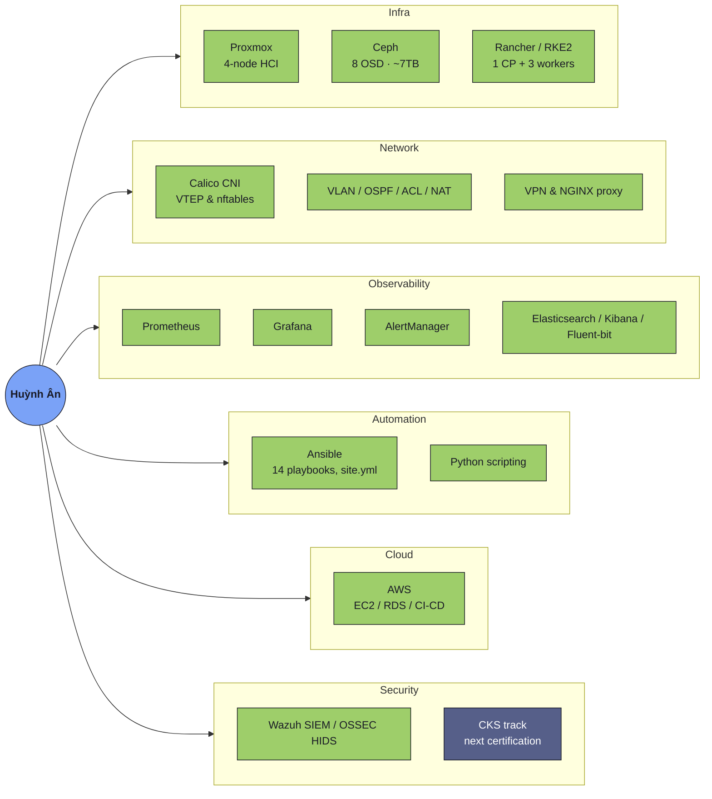

<h1 align="center">Hi 👋, I'm Huỳnh Ân</h1>

  

<table width="100%">
  <tr>
    <td width="60%" valign="top">
      
2nd-year CS student at UIT, Vietnam. I intern at a company and run production infrastructure on real hardware. When something breaks, I document the root cause and fix it properly.

      

        
        
      

      

        
        
        
        
      

    </td>
    <td width="40%" valign="top" align="center">
      <!--
        TODO: this widget needs YOUR OAuth authorization, a public profile link isn't enough.
        1. Go to https://spotify-recently-played.jeffreyca.workers.dev
        2. Click "Connect with Spotify" and log in with your own account
        3. Pick theme "Tokyo Night", Tracks = 5
        4. Click "Copy snippet" and paste it here, replacing this whole <td>...</td> block
      -->
      
    </td>
  </tr>
</table>

---

<table width="100%">
  <thead>
    <tr><th align="left">My Journey</th></tr>
  </thead>
  <tbody>
    <tr>
      <td>
        
I run a 4-node Proxmox cluster with Ceph storage (8 OSDs, ~7TB) and a Rancher/RKE2 Kubernetes cluster on physical hardware during my internship. I've debugged Calico VTEP conflicts and recovered etcd from a NOSPACE alarm. Prometheus and Grafana cover monitoring for the whole stack. Right now I'm studying for the CKA and AWS SAA to put a certification behind work I already do.

        

          
        

        
My Ansible playbooks deploy that cluster end to end — 14 playbooks under one site.yml, including automated teardown and rebuild. Networking is my strongest starting point from school: VLANs, OSPF, RIP, ACLs, NAT. CCNA, Terraform, and a service mesh lab are next.

        

          
        

        
I'm building toward two roles at once: Cloud Security Engineer and Platform Engineer. Both need the same Kubernetes and cloud foundation before they split — CKS and AWS Security Specialty on one side, Terraform and GitOps on the other.

        

          
        

      </td>
    </tr>
  </tbody>
</table>

---

### 🛠️ Stack I run daily

  

**No icon exists for these, but I run them daily:** Proxmox (4-node hyperconverged cluster), Ceph (distributed storage, CRUSH, monmap recovery), Rancher/RKE2, Calico CNI, etcd, Ceph CSI RBD, Cisco networking (VLAN/OSPF/RIP/ACL/NAT), Wazuh SIEM, OSSEC HIDS, ssacli (HP Smart Array RAID).

### 🗺️ Where I stand

> GitHub does not render Mermaid `mindmap` diagrams. This is a `graph` with subgraphs instead.

---

### 🎓 Certifications

<!-- Once you earn a cert, go to its Credly badge page > Share > Embed, and swap the image/link below. -->

  
  
  

---

### 📌 Featured project

---

### 📊 GitHub Stats

<table width="100%">
  <tr>
    <td width="50%"></td>
    <td width="50%"></td>
  </tr>
</table>
